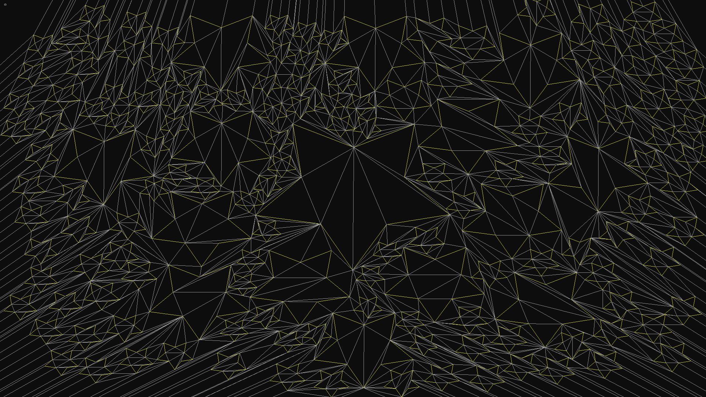
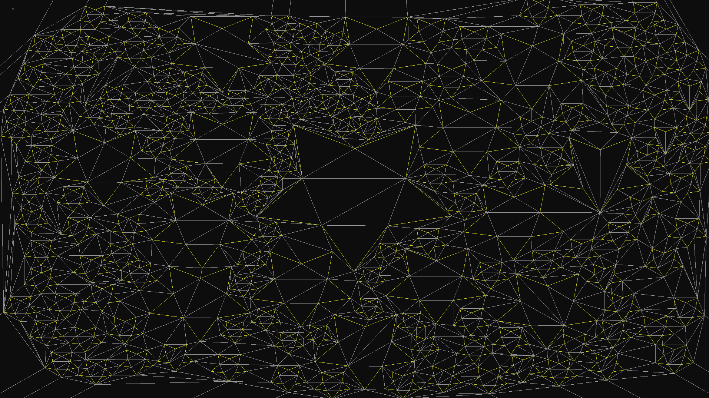

# CDT

**CDT** is a single-header, stb-style C library for **incremental 2D Constrained Delaunay Triangulation**, designed with game development in mind.

## What is CDT?

CDT stands for **Constrained Delaunay Triangulation**.  
It produces high-quality, "fat" triangles instead of long, thin "sliver" triangles, which results in significantly better navigation meshes and more stable geometry processing.

### Visual comparison

**Without Delaunay refinement (many thin triangles):**

**With Constrained Delaunay Triangulation (CDT):**

## Why should I consider this library?
- It is fully dynamic: you can add or remove obstacles (constraints) at runtime, during gameplay.
- It is a single-header C library (stb-style): just include one file, no dependencies, easy to use and easy to port.
