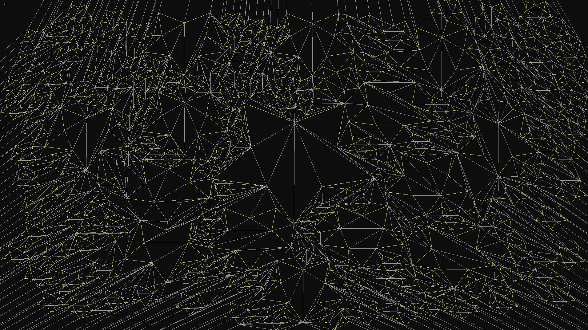
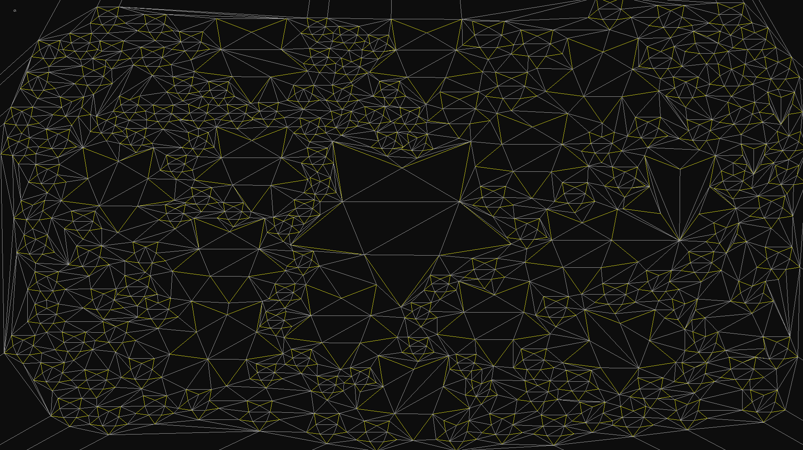
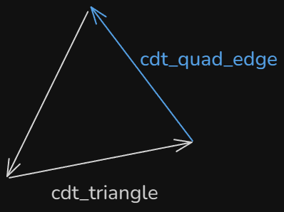
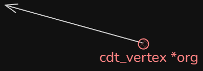
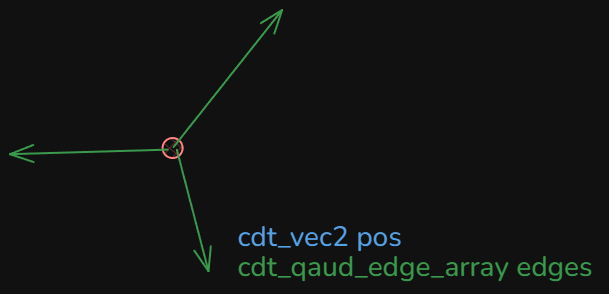
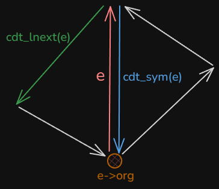
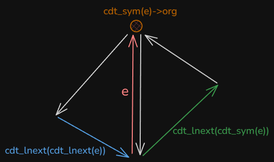
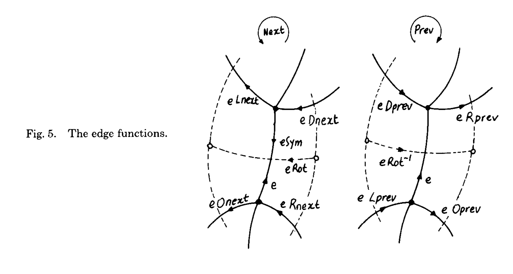

# CDT

**CDT** is a single-header, stb-style C library for **incremental 2D Constrained Delaunay Triangulation**, designed with game development in mind.

## What is CDT?

CDT stands for **Constrained Delaunay Triangulation**.  
It produces high-quality, "fat" triangles instead of long, thin "sliver" triangles, which results in significantly better navigation meshes and more stable geometry processing.

### Visual comparison

**Without Delaunay refinement (many thin triangles):**



**With Constrained Delaunay Triangulation (CDT):**




## Why should I consider this library?
- It is fully dynamic: you can add or remove obstacles (constraints) at runtime, during gameplay.
- It is a single-header C library (stb-style): just include one file, no dependencies, easy to use and easy to port.

## What are the downsides?
- The library is not fully optimized yet, but it is still usable.
- Since the core is currently based on quad-edges and does not retain triangles, iterating over all triangles is somewhat cumbersome and inefficient at the moment.
- Familiarity with basic quad-edge operators is recommended to fully utilize this library.

## Data Structure Explanation
First, note that a triangle consists of three directed edges ordered counter-clockwise; thus, each directed edge is associated with exactly one triangle. 
In this library, a directed edge is aliased as a quad-edge.



A quad-edge structure stores the vertex from which it originates.



A vertex stores its coordinates and an array of quad-edges that originate from it.



## Quad-Edge Operators
Those are the most basic operators you'll most likely care about.



Then, you can do something like this:



The library provides the full set of operators; however, as aforementioned above, you'll 
most likely care about <strong>sym</strong>, <strong>lnext</strong> and <strong>org</strong>.



## How to build examples
#### Windows (MSVC cl x64)
Simply run <strong>build.bat</strong> within the root directory.
``` console
> build
```
